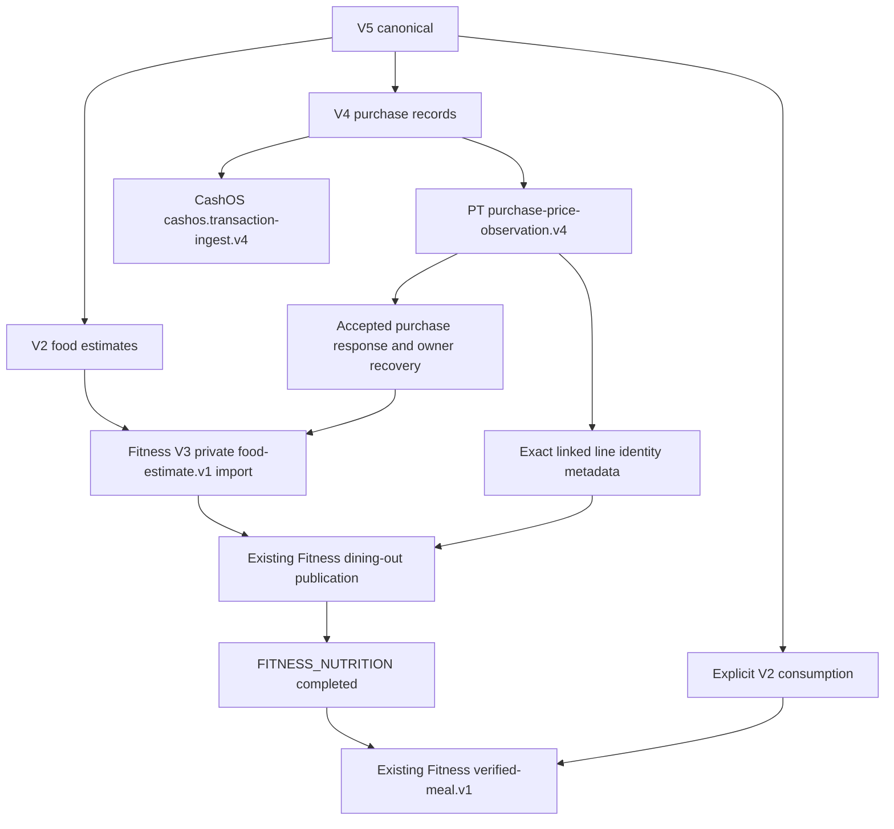

# yeonsik-ocr.v5: 식당 구매 기록과 음식 사진

V5는 비영수증 식당 주문·결제 사실과 음식 사진 기반 영양 추정치를 하나의 canonical과 기존 `.yeonsik` ZIP으로 처리한다. 주문내역만 있으면 V4, 영수증과 음식 사진이면 V2를 계속 사용한다. 자동 승격이나 이름 기반 연결은 없다.

기준: OCR-App `origin/main`의 `d8e64f8`을 fetch/pull한 뒤 `feat/ocr-v5-restaurant-purchase`에서 구현했다. 2026-10-09 후속 정합성 수정은 fetch한 PriceTrace `origin/feat/ocr-purchase-line-resolution`의 `0007dc9`와 Fitness `feat/ocr-v5-fitness-compat`의 `dcf8fe2` 계약을 대조했다. 다른 저장소의 production 파일과 기존 아이콘·설정 작업은 변경하지 않았다.

## 정확한 wire shape

top-level은 아래 **14개 key와 정확히 일치**해야 한다. 누락·추가 key는 거부한다.

| Key | V5 값과 규칙 |
| --- | --- |
| `schema_version` | `"yeonsik-ocr.v5"` |
| `mode` | `"restaurant_purchase"` |
| `source` | V2/V4의 `{producer, source_files, user_text}`. source file은 `{id, type, label}`. type은 `order_history`, `payment_history`, `food_photo`만 허용. ID는 중복 없이 비어 있지 않아야 함 |
| `merchant_candidate` | `null` |
| `receipt` | `null` |
| `product_candidates` | `[]` |
| `price_observations` | `[]` |
| `purchase_records` | 1개 이상. 기존 V4 필드·금액·날짜·evidence 검증 재사용. `purchase_kind = "restaurant"` |
| `nutrition` | 1개 이상. 기존 V2 `restaurant_estimate`. `line_id = null`. 필수 영양소 provenance는 `food_image_estimate`, evidence_refs는 실제 선언된 `food_photo` ID |
| `consumption` | 기존 V2 item-level 계약. 선택 사항. 구매 사실만으로 생성하지 않음 |
| `classification_hints` | 기존 `{cashos: {category_hint, institution_hint, payment_method_hint}}` |
| `links` | 아래 exact 3-key 객체 배열. 모든 nutrition에 정확한 구매 행 하나가 연결되어야 함 |
| `projection_targets` | 기존 projection 이름. PT 가격, CashOS transaction, Fitness Nutrition/Meal. Core가 실제 적격성을 계산 |
| `review` | 기존 `{status, blocking_issues, warnings}`. 기존 로컬 persistence 경로만 `verification_basis`를 보존 |

```json
{
  "purchase_record_client_key": "purchase-1",
  "purchase_line_key": "line-1",
  "nutrition_client_key": "food-1"
}
```

세 key는 비어 있을 수 없다. record, 해당 record의 실제 `line_items.line_key`, 실제 nutrition을 참조해야 한다. dangling, duplicate, conflicting link를 거부한다. 링크가 있는 행에는 명시적인 V4 `line_key`가 필요하다. 연결되지 않은 다른 구매 행으로부터 영양을 생성하지 않는다. V3 `priceObservationClientKey`를 구매 행 key로 사용하지 않는다.

전체 유효 JSON: [V5 예제](../examples/yeonsik-ocr.v5.restaurant-purchase.example.json). 예제의 주문·결제·음식 파일은 합성 source 선언이며 실제 evidence 파일을 포함하지 않는다.

`source.user_text` 구매 증거는 V4의 user_statement 경계를 유지한다. consumption에는 명시적인 사용자 텍스트가 필요하며, `consumed_at`이 있으면 그 ISO timestamp가 `source.user_text`에 명시되어야 한다. 주문·결제 시각을 섭취 시각으로 복사하지 않는다. 외부 review와 consumption verification은 import 시 폐기하고 로컬 검토 후에만 승격한다. 공개 identity UUID를 producer가 입력하는 필드는 없다.

## Evidence와 revision

ZIP 형식은 계속 `yeonsik-bundle.v1`이다. 기존 reader가 canonical/source ID/type과 manifest를 1:1로 binding하고, SHA-256와 byte_size 및 materialized bytes를 검증한다. 기존 evidence archive와 owner/hash checkpoint를 재사용한다.

V5 gate는 purchase artifact의 history evidence와 nutrition artifact의 food evidence를 독립적으로 확인한다. 주문 사진은 영양 evidence를 충족하지 않고 음식 사진은 구매 evidence가 되지 않는다. 선언된 food ID별로 읽을 수 있는 FOOD_PHOTO binding이 있어야 한다. manual review도 음식 evidence를 대신하지 않는다.

Android/Desktop은 공통 ReviewViewModel에서 구매 정보·행·영양·연결·destination 상태와 이유를 보여준다. CanonicalFieldRegistry/CanonicalReviewController에서 구매 필드, 영양 필드, 연결 record/line key를 편집한다. 매 변경은 domain validation을 다시 통과하고 기존 revision/audit/undo 경로를 사용한다. 잘못된 연결 수정은 이전 값을 보존한다. 원본 선언과 provenance를 바꾸는 수정은 기존 전체 canonical JSON 편집 경로를 사용한다.

## Projection dependency graph



연결된 구매 record 중 PT 제출이 가능한 record가 있으면 Fitness Nutrition은 PT projection을 dependency로 가진다. Fitness만 선택해도 기존 dependency scheduler가 PT를 먼저 실행하고 metadata를 전달한다. PT 제출이 구조적으로 불가능하면 이 dependency를 만들지 않으며 private Nutrition을 시도할 수 있다. PT 원본이 accepted지만 관측이 생성되지 않은 경우, 행 전체와 authority metadata를 검증한 source-only 응답도 private import의 선행 단계 완료로 인정한다. 가격 관측 projection 자체는 BLOCKED를 유지하고 공개 등록의 exact identity 요구는 유지한다. CashOS는 기존 독립 V4 경로다.

Meal의 Core dependency는 Fitness Nutrition이다. 현재 Fitness pipeline에서 Nutrition projection의 최종 완료는 dining-out publication까지 포함한다. private import만 성공했다고 public publication이나 projection 전체를 성공으로 표시하지 않는다. identity가 없거나 모호하면 private import metadata를 보존하고 `pricetrace_purchase_line_identity_metadata_missing:<nutrition key>`로 검토 대기를 반환한다. 따라서 Meal은 계획되더라도 해당 publication이 해결되기 전에는 전송되지 않는다.

V5 restaurant estimate는 기존 `import_canonical_nutrition_v3`의 `food-estimate.v1` 경로를 호출한다. 네 가지 packaged-product hierarchy 값은 모두 null이다. Fitness compat branch가 재현한 V2 estimate replay의 PostgreSQL `42702` 결함을 우회하며 Fitness production 계약은 수정하지 않는다. private import에는 PT identity를 넣지 않고, 이후 복구된 identity는 별도 publication 요청에만 전달한다. authority 유무가 달라져도 private import의 request와 idempotency key는 유지한다. V1–V4의 RPC route는 기존 그대로다.

Meal은 V5 로컬 metadata의 nutrition_client_key로 import 결과를 선택하여 publication 행이나 응답 순서를 영양 항목으로 오인하지 않는다. RPC는 기존 verified-meal.v1 그대로이며 source JSON provenance는 V5 origin과 dining_out 종류를 유지한다.

pending/cancelled/refunded 구매의 PT/CashOS 적격성은 V4와 동일하다. 해당 상태 때문에 음식 사진과 영양 source facts를 삭제하지 않는다. private Nutrition import는 별도로 시도할 수 있다.

## PriceTrace 응답과 추가 저장소 작업

OCR의 기존 V4 submitter가 record별 응답에 로컬 `purchaseRecordClientKey` correlation을 붙인다. V5에서는 반환 `lineResults.lineKey` 집합이 제출한 `items[].line_key` 집합과 정확히 일치해야 한다. missing/duplicate/blank/unexpected key를 모두 거부한다. 응답 순서나 메뉴 이름으로 연결하지 않는다. 기존 V4 response 해석은 그대로 유지한다.

V4 seller는 omission과 null을 구분한다. `sellerOverride == null && record.seller != null`이면 line `seller` key를 생략하여 record의 verified seller/branch/source namespace/code를 상속한다. record seller도 없으면 명시적인 null이다. 다른 override는 독립적으로 관측한 이름만 전달하며 record/platform의 namespace/code를 복사하지 않는다. `option_text` 원본은 공백까지 보존한다.

PriceTrace의 최신 기능 브랜치는 기존 V4 응답에 `purchase-line-authority.v1` metadata를 추가하고 owner getter를 제공한다. OCR은 exact record client key + line key를 유지하며 다음 서버 metadata를 검증한다.

- `kind = restaurant_purchase`
- `sourceAcceptanceStatus = accepted`, `observationCreated = true`, `observationStatus = created`
- `merchantResolutionStatus`, `menuResolutionStatus`, `authorityStatus`가 모두 `exact`
- 유효한 UUID `observationId`와 `observationType = restaurant_menu_manual_observation`
- `authoritativeIds`의 `restaurantId`, `restaurantLocationId`, `restaurantMenuId`, `catalogProductId`가 유효한 UUID

immediate V4 응답이나 저장된 checkpoint에 authority metadata가 없으면 응답에서 받은 server-issued `purchaseSourceId`로 `get_purchase_price_ingestion_response_v1(p_purchase_source_id uuid)`를 호출한다. selector와 반환 UUID, 모든 record/line binding을 검증한 뒤 로컬 metadata를 교체한다. checkpoint 복구는 구매 재제출을 하지 않는다. getter 장애 시 accepted 응답을 보존하여 다음 retry에서 owner read를 다시 수행한다. UUID는 canonical/source JSON에 기록하지 않는다.

metadata 누락·중복 source/line·ambiguity·다른 key는 모두 fail-closed다. 이번 OCR 작업은 서버 migration이나 production 계약을 만들지 않았다. 운영에는 PriceTrace 브랜치의 `20261009040159` runtime compatibility 및 `20261009040200` authority/getter migration 배포가 필요하다. Fitness/CashOS에는 V5용 RPC나 DB 변경이 필요하지 않으며 기존 API를 호출한다. migration의 실제 원격 적용은 이번 작업에서 실행·검증하지 않았다.

## 변경 파일

다음 31개 파일은 초기 V5 구현 범위다. 기존 README, launcher icons, desktop build 설정, untracked Supabase/package 작업은 포함하지 않았다.

```text
app/src/main/java/com/pricetrace/receiptocr/ReceiptAppViewModel.kt
app/src/test/java/com/pricetrace/receiptocr/AndroidCanonicalJsonValidatorTest.kt
app/src/test/java/com/pricetrace/receiptocr/fitness/FitnessCanonicalProjectionSubmitterTest.kt
app/src/test/java/com/pricetrace/receiptocr/fitness/FitnessMealProjectionSubmitterTest.kt
app/src/test/java/com/pricetrace/receiptocr/pricetrace/CashOsReceiptGatewayTest.kt
app/src/test/java/com/pricetrace/receiptocr/pricetrace/PriceTraceCanonicalGatewayTest.kt
core/src/main/java/com/pricetrace/receiptocr/fitness/FitnessCanonicalProjectionSubmitter.kt
core/src/main/java/com/pricetrace/receiptocr/fitness/FitnessMealProjectionSubmitter.kt
core/src/main/java/com/pricetrace/receiptocr/pricetrace/PriceTraceCanonicalGateway.kt
core/src/main/java/com/pricetrace/receiptscanner/importer/ExternalJsonImporter.kt
core/src/main/java/com/pricetrace/receiptscanner/ingestion/CanonicalEnvelopeValidator.kt
core/src/main/java/com/pricetrace/receiptscanner/ingestion/CanonicalProjectionPlanner.kt
core/src/main/java/com/pricetrace/receiptscanner/ingestion/IngestionEvidenceGate.kt
core/src/main/java/com/pricetrace/receiptscanner/ingestion/IngestionModels.kt
core/src/main/java/com/pricetrace/receiptscanner/ingestion/IngestionOrchestrator.kt
core/src/main/java/com/pricetrace/receiptscanner/ingestion/PurchaseNutritionIdentity.kt
core/src/main/java/com/pricetrace/receiptscanner/ingestion/YeonsikOcrEnvelopeCodec.kt
core/src/main/java/com/pricetrace/receiptscanner/ingestion/YeonsikOcrEnvelopeJson.kt
core/src/main/java/com/pricetrace/receiptscanner/ingestion/YeonsikOcrV2Json.kt
core/src/main/java/com/pricetrace/receiptscanner/ingestion/YeonsikOcrV3Json.kt
core/src/main/java/com/pricetrace/receiptscanner/ingestion/YeonsikOcrV4Json.kt
core/src/main/java/com/pricetrace/receiptscanner/ingestion/YeonsikOcrV5Json.kt
core/src/main/java/com/pricetrace/receiptscanner/review/CanonicalFieldRegistry.kt
core/src/main/java/com/pricetrace/receiptscanner/review/CanonicalReviewController.kt
core/src/main/java/com/pricetrace/receiptscanner/review/ReviewViewModel.kt
core/src/test/java/com/pricetrace/receiptscanner/ingestion/YeonsikBundleTest.kt
core/src/test/java/com/pricetrace/receiptscanner/ingestion/YeonsikOcrV5Test.kt
desktop-app/src/main/kotlin/com/yeonsik/ingestion/desktop/DesktopIngestionController.kt
desktop-app/src/test/kotlin/com/yeonsik/ingestion/desktop/DesktopIngestionRegressionTest.kt
docs/YEONSIK_OCR_V5_RESTAURANT_PURCHASE.md
examples/yeonsik-ocr.v5.restaurant-purchase.example.json
```

## 검증과 운영 전제

후속 계약 정합성 수정의 실제 변경 파일은 다음 11개다.

```text
core/src/main/java/com/pricetrace/receiptscanner/publisher/PurchaseEvidenceV4Models.kt
core/src/main/java/com/pricetrace/receiptocr/fitness/FitnessCanonicalProjectionSubmitter.kt
core/src/main/java/com/pricetrace/receiptocr/pricetrace/PriceTraceCanonicalGateway.kt
core/src/main/java/com/pricetrace/receiptscanner/ingestion/CanonicalProjectionPlanner.kt
core/src/main/java/com/pricetrace/receiptscanner/ingestion/IngestionOrchestrator.kt
core/src/main/java/com/pricetrace/receiptscanner/ingestion/PurchaseNutritionIdentity.kt
core/src/test/java/com/pricetrace/receiptscanner/ingestion/YeonsikOcrV4PurchaseTest.kt
core/src/test/java/com/pricetrace/receiptscanner/ingestion/YeonsikOcrV5Test.kt
app/src/test/java/com/pricetrace/receiptocr/pricetrace/PriceTraceCanonicalGatewayTest.kt
app/src/test/java/com/pricetrace/receiptocr/fitness/FitnessCanonicalProjectionSubmitterTest.kt
docs/YEONSIK_OCR_V5_RESTAURANT_PURCHASE.md
```

- A: paid 식당 구매 + 음식 사진 → 독립 PT/CashOS/Nutrition 계획, 기존 adapter payload 검증
- B: explicit consumption → Meal 계획과 기존 Meal RPC payload 검증
- C: 구매 2행/사진 1개 → 연결된 1행에만 nutrition 유지
- D: dangling/duplicate/conflicting link → 거부
- E/F: 주문만 V4, 영수증+음식 V2 유지
- G: unsettled 상태 → V4 sink eligibility 유지, Nutrition source 유지
- H: identity 누락·모호함 → private import metadata 보존, public publication 대기
- I: 동일 bundle replay → 성공 sibling 재전송 없음; adapter replay key 유지
- J: 전체 Core/Android/Desktop 회귀 테스트

후속 수정은 seller inheritance/unknown/independent override와 원본 option_text, 누락·중복·blank·unexpected 반환 행, legacy immediate/checkpoint owner recovery, null/부분 metadata 복구, record 순서가 달라도 동일 line key가 교차 연결되지 않는 검증을 추가했다. PT→V3 private import→public publication은 실제 OCR submitter들을 fake HTTP transport에 연결하여 실행했다. Fitness만 선택한 dependency scheduling, PT 제출 불가 시 private import, accepted source-only 이후 private import, 동일 bundle의 완료 sink 재전송 방지도 검증했다. 기존 CashOS V4와 V1–V4 로컬 회귀 테스트는 통과했다.

최종 실행 명령은 `./gradlew.bat test lint assembleDebug :desktop-app:jar --no-daemon`이다. test XML 기준 Core 249/249, Android app 119/119, receipt-scanner 172/172, Desktop 42개 통과와 2개 skipped: **총 582개 통과, 실패 0, skipped 2개**다. skipped는 `YEONSIK_CHECKPOINT_INTEGRATION_RECORD` 환경과 explicit owner approval + `YEONSIK_APPROVED_CHECKPOINT_ID`가 필요한 기존 원격 테스트다. Android debug APK, receipt-scanner AAR, Desktop jar와 lint를 실행했다. lint report는 app 오류 0/경고 47, receipt-scanner 오류 0/경고 0이다. `git diff --check`도 실행했다.

네트워크 호출 테스트는 fake transport 기반이다. 실 Supabase RPC/RLS/Storage, downstream row 중복 방지의 원격 실행, Android 실제 기기와 Desktop GUI 통합 흐름은 **UNVERIFIED**다. Fitness의 기존 V2 SQL replay defect를 고친 것으로 보고하지 않으며 V5는 기존 V3로 우회한다. 운영에는 기존 세 downstream 계정/endpoint, Evidence archive, 실제 원본 파일, producer V5 지원, PT authority/getter migration 배포 및 Fitness의 기존 V3 endpoint/replay fix 배포가 필요하다. 원격 migration 적용 상태는 이번 작업에서 확인하지 않았다.
