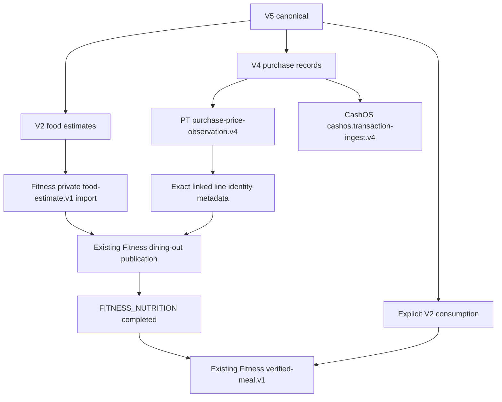

# yeonsik-ocr.v5: 식당 구매 기록과 음식 사진

V5는 비영수증 식당 주문·결제 사실과 음식 사진 기반 영양 추정치를 하나의 canonical과 기존 `.yeonsik` ZIP으로 처리한다. 주문내역만 있으면 V4, 영수증과 음식 사진이면 V2를 계속 사용한다. 자동 승격이나 이름 기반 연결은 없다.

기준: OCR-App `origin/main`의 `d8e64f8`을 fetch/pull한 뒤 `feat/ocr-v5-restaurant-purchase`에서 구현했다. PriceTrace는 fetch한 `origin/main`의 `df8bd63` 계약을 읽었다. PriceTrace의 아이콘 작업과 현재 checkout은 변경하지 않았다.

## 정확한 wire shape

top-level은 아래 **14개 key와 정확히 일치**해야 한다. 누락·추가 key는 거부한다.

| Key | V5 값과 규칙 |
| --- | --- |
| `schema_version` | `"yeonsik-ocr.v5"` |
| `mode` | `"restaurant_purchase"` |
| `source` | V2/V4의 `{producer, source_files, user_text}`. source file은 `{id, type, label}`. type은 `order_history`, `payment_history`, `food_photo`만 허용. ID는 중복 없이 비어 있지 않아야 함 |
| `merchant_candidate` | `null` |
| `receipt` | `null` |
| `product_candidates` | `[]` |
| `price_observations` | `[]` |
| `purchase_records` | 1개 이상. 기존 V4 필드·금액·날짜·evidence 검증 재사용. `purchase_kind = "restaurant"` |
| `nutrition` | 1개 이상. 기존 V2 `restaurant_estimate`. `line_id = null`. 필수 영양소 provenance는 `food_image_estimate`, evidence_refs는 실제 선언된 `food_photo` ID |
| `consumption` | 기존 V2 item-level 계약. 선택 사항. 구매 사실만으로 생성하지 않음 |
| `classification_hints` | 기존 `{cashos: {category_hint, institution_hint, payment_method_hint}}` |
| `links` | 아래 exact 3-key 객체 배열. 모든 nutrition에 정확한 구매 행 하나가 연결되어야 함 |
| `projection_targets` | 기존 projection 이름. PT 가격, CashOS transaction, Fitness Nutrition/Meal. Core가 실제 적격성을 계산 |
| `review` | 기존 `{status, blocking_issues, warnings}`. 기존 로컬 persistence 경로만 `verification_basis`를 보존 |

```json
{
  "purchase_record_client_key": "purchase-1",
  "purchase_line_key": "line-1",
  "nutrition_client_key": "food-1"
}
```

세 key는 비어 있을 수 없다. record, 해당 record의 실제 `line_items.line_key`, 실제 nutrition을 참조해야 한다. dangling, duplicate, conflicting link를 거부한다. 링크가 있는 행에는 명시적인 V4 `line_key`가 필요하다. 연결되지 않은 다른 구매 행으로부터 영양을 생성하지 않는다. V3 `priceObservationClientKey`를 구매 행 key로 사용하지 않는다.

전체 유효 JSON: [V5 예제](../examples/yeonsik-ocr.v5.restaurant-purchase.example.json). 예제의 주문·결제·음식 파일은 합성 source 선언이며 실제 evidence 파일을 포함하지 않는다.

`source.user_text` 구매 증거는 V4의 user_statement 경계를 유지한다. consumption에는 명시적인 사용자 텍스트가 필요하며, `consumed_at`이 있으면 그 ISO timestamp가 `source.user_text`에 명시되어야 한다. 주문·결제 시각을 섭취 시각으로 복사하지 않는다. 외부 review와 consumption verification은 import 시 폐기하고 로컬 검토 후에만 승격한다. 공개 identity UUID를 producer가 입력하는 필드는 없다.

## Evidence와 revision

ZIP 형식은 계속 `yeonsik-bundle.v1`이다. 기존 reader가 canonical/source ID/type과 manifest를 1:1로 binding하고, SHA-256와 byte_size 및 materialized bytes를 검증한다. 기존 evidence archive와 owner/hash checkpoint를 재사용한다.

V5 gate는 purchase artifact의 history evidence와 nutrition artifact의 food evidence를 독립적으로 확인한다. 주문 사진은 영양 evidence를 충족하지 않고 음식 사진은 구매 evidence가 되지 않는다. 선언된 food ID별로 읽을 수 있는 FOOD_PHOTO binding이 있어야 한다. manual review도 음식 evidence를 대신하지 않는다.

Android/Desktop은 공통 ReviewViewModel에서 구매 정보·행·영양·연결·destination 상태와 이유를 보여준다. CanonicalFieldRegistry/CanonicalReviewController에서 구매 필드, 영양 필드, 연결 record/line key를 편집한다. 매 변경은 domain validation을 다시 통과하고 기존 revision/audit/undo 경로를 사용한다. 잘못된 연결 수정은 이전 값을 보존한다. 원본 선언과 provenance를 바꾸는 수정은 기존 전체 canonical JSON 편집 경로를 사용한다.

## Projection dependency graph



계획 단계에서 PT/CashOS/Fitness Nutrition은 독립적이다. Meal의 Core dependency는 Fitness Nutrition이다. 현재 Fitness pipeline에서 Nutrition projection의 최종 완료는 dining-out publication까지 포함한다. private import만 성공했다고 public publication이나 projection 전체를 성공으로 표시하지 않는다. identity가 없거나 모호하면 private import metadata를 보존하고 `pricetrace_purchase_line_identity_metadata_missing:<nutrition key>`로 검토 대기를 반환한다. 따라서 Meal은 계획되더라도 해당 publication이 해결되기 전에는 전송되지 않는다.

Meal은 V5 로컬 metadata의 nutrition_client_key로 import 결과를 선택하여 publication 행이나 응답 순서를 영양 항목으로 오인하지 않는다. RPC는 기존 verified-meal.v1 그대로이며 source JSON provenance는 V5 origin과 dining_out 종류를 유지한다.

pending/cancelled/refunded 구매의 PT/CashOS 적격성은 V4와 동일하다. 해당 상태 때문에 음식 사진과 영양 source facts를 삭제하지 않는다. private Nutrition import는 별도로 시도할 수 있다.

## PriceTrace 응답과 추가 저장소 작업

OCR의 기존 V4 submitter가 record별 응답에 로컬 `purchaseRecordClientKey` correlation을 붙인다. V5에서는 서버 `lineResults.lineKey` 중복·알 수 없는 key를 거부한다. 응답 순서나 메뉴 이름으로 연결하지 않는다. 기존 V4 response 해석은 그대로 유지한다.

확인한 PriceTrace main의 `20260911140000_purchase_price_observation_v4.sql`은 lineResults에 lineKey, observationCreated, observationId/type 또는 reason을 반환한다. **현재 응답에는 정확한 식당/지점/메뉴/catalog ID와 resolution status가 없다.** 관측 ID만으로 공개 식당 identity를 추정하거나 생성하지 않는다.

향후 공개 등록을 실제 완료하려면 PriceTrace의 기존 V4 RPC 응답이 각 lineKey에 서버 검증된 다음 metadata를 제공해야 한다. OCR은 기존 exact-identity decoder를 재사용할 준비가 되어 있다.

- `kind = restaurant_purchase`
- `merchantResolutionStatus`와 `menuResolutionStatus`가 `exact` 또는 `resolved`
- 선택적인 `authorityStatus = exact`, `ocrResolution.status = resolved`
- `authoritativeIds`의 `restaurantId`, `restaurantLocationId`, `restaurantMenuId`, `catalogProductId`가 유효한 UUID

metadata 누락·중복 source/line·ambiguity·다른 key는 모두 fail-closed다. 이번 작업은 해당 서버 response 확장이나 migration을 만들지 않았다. PriceTrace 쪽이 authority를 제공해야 하므로 이 prerequisite은 OCR의 이름 매칭으로 대체할 수 없다. Fitness/CashOS에는 V5용 RPC나 DB 변경이 필요하지 않으며 기존 API를 호출한다.

## 변경 파일

다음 31개 파일이 이번 V5 작업의 실제 변경 범위다. 기존 README, launcher icons, desktop build 설정, untracked Supabase/package 작업은 포함하지 않았다.

```text
app/src/main/java/com/pricetrace/receiptocr/ReceiptAppViewModel.kt
app/src/test/java/com/pricetrace/receiptocr/AndroidCanonicalJsonValidatorTest.kt
app/src/test/java/com/pricetrace/receiptocr/fitness/FitnessCanonicalProjectionSubmitterTest.kt
app/src/test/java/com/pricetrace/receiptocr/fitness/FitnessMealProjectionSubmitterTest.kt
app/src/test/java/com/pricetrace/receiptocr/pricetrace/CashOsReceiptGatewayTest.kt
app/src/test/java/com/pricetrace/receiptocr/pricetrace/PriceTraceCanonicalGatewayTest.kt
core/src/main/java/com/pricetrace/receiptocr/fitness/FitnessCanonicalProjectionSubmitter.kt
core/src/main/java/com/pricetrace/receiptocr/fitness/FitnessMealProjectionSubmitter.kt
core/src/main/java/com/pricetrace/receiptocr/pricetrace/PriceTraceCanonicalGateway.kt
core/src/main/java/com/pricetrace/receiptscanner/importer/ExternalJsonImporter.kt
core/src/main/java/com/pricetrace/receiptscanner/ingestion/CanonicalEnvelopeValidator.kt
core/src/main/java/com/pricetrace/receiptscanner/ingestion/CanonicalProjectionPlanner.kt
core/src/main/java/com/pricetrace/receiptscanner/ingestion/IngestionEvidenceGate.kt
core/src/main/java/com/pricetrace/receiptscanner/ingestion/IngestionModels.kt
core/src/main/java/com/pricetrace/receiptscanner/ingestion/IngestionOrchestrator.kt
core/src/main/java/com/pricetrace/receiptscanner/ingestion/PurchaseNutritionIdentity.kt
core/src/main/java/com/pricetrace/receiptscanner/ingestion/YeonsikOcrEnvelopeCodec.kt
core/src/main/java/com/pricetrace/receiptscanner/ingestion/YeonsikOcrEnvelopeJson.kt
core/src/main/java/com/pricetrace/receiptscanner/ingestion/YeonsikOcrV2Json.kt
core/src/main/java/com/pricetrace/receiptscanner/ingestion/YeonsikOcrV3Json.kt
core/src/main/java/com/pricetrace/receiptscanner/ingestion/YeonsikOcrV4Json.kt
core/src/main/java/com/pricetrace/receiptscanner/ingestion/YeonsikOcrV5Json.kt
core/src/main/java/com/pricetrace/receiptscanner/review/CanonicalFieldRegistry.kt
core/src/main/java/com/pricetrace/receiptscanner/review/CanonicalReviewController.kt
core/src/main/java/com/pricetrace/receiptscanner/review/ReviewViewModel.kt
core/src/test/java/com/pricetrace/receiptscanner/ingestion/YeonsikBundleTest.kt
core/src/test/java/com/pricetrace/receiptscanner/ingestion/YeonsikOcrV5Test.kt
desktop-app/src/main/kotlin/com/yeonsik/ingestion/desktop/DesktopIngestionController.kt
desktop-app/src/test/kotlin/com/yeonsik/ingestion/desktop/DesktopIngestionRegressionTest.kt
docs/YEONSIK_OCR_V5_RESTAURANT_PURCHASE.md
examples/yeonsik-ocr.v5.restaurant-purchase.example.json
```

## 검증과 운영 전제

- A: paid 식당 구매 + 음식 사진 → 독립 PT/CashOS/Nutrition 계획, 기존 adapter payload 검증
- B: explicit consumption → Meal 계획과 기존 Meal RPC payload 검증
- C: 구매 2행/사진 1개 → 연결된 1행에만 nutrition 유지
- D: dangling/duplicate/conflicting link → 거부
- E/F: 주문만 V4, 영수증+음식 V2 유지
- G: unsettled 상태 → V4 sink eligibility 유지, Nutrition source 유지
- H: identity 누락·모호함 → private import metadata 보존, public publication 대기
- I: 동일 bundle replay → 성공 sibling 재전송 없음; adapter replay key 유지
- J: 전체 Core/Android/Desktop 회귀 테스트

최종 실행: `./gradlew.bat :core:test :desktop-app:test :app:testDebugUnitTest :app:assembleDebug :app:lintDebug --no-daemon` 성공. 현재 test XML 기준 Core 246/246, Android 111/111, Desktop 42개 통과와 2개 skipped. 총 399개 통과, 실패 0. skipped는 owner HTTP checkpoint 환경과 명시적 owner approval이 필요한 기존 원격 테스트다. Android debug APK 빌드와 lint 성공(기존 경고는 남아 있음). `git diff --check` 성공. 공통 검토 모델과 Desktop controller에 대한 Impeccable detector 결과는 `[]`였다. 네트워크 호출 테스트는 fake transport 기반이다. 실 Supabase RPC/RLS/Storage, downstream row 중복 방지의 원격 실행, Android 실제 기기와 Desktop GUI의 통합 흐름은 **UNVERIFIED**다. 운영에는 기존 세 downstream 계정/endpoint와 Evidence archive 설정, 실제 원본 파일, producer의 V5 생성 지원 및 앞서 명시한 PT authority response가 필요하다.
