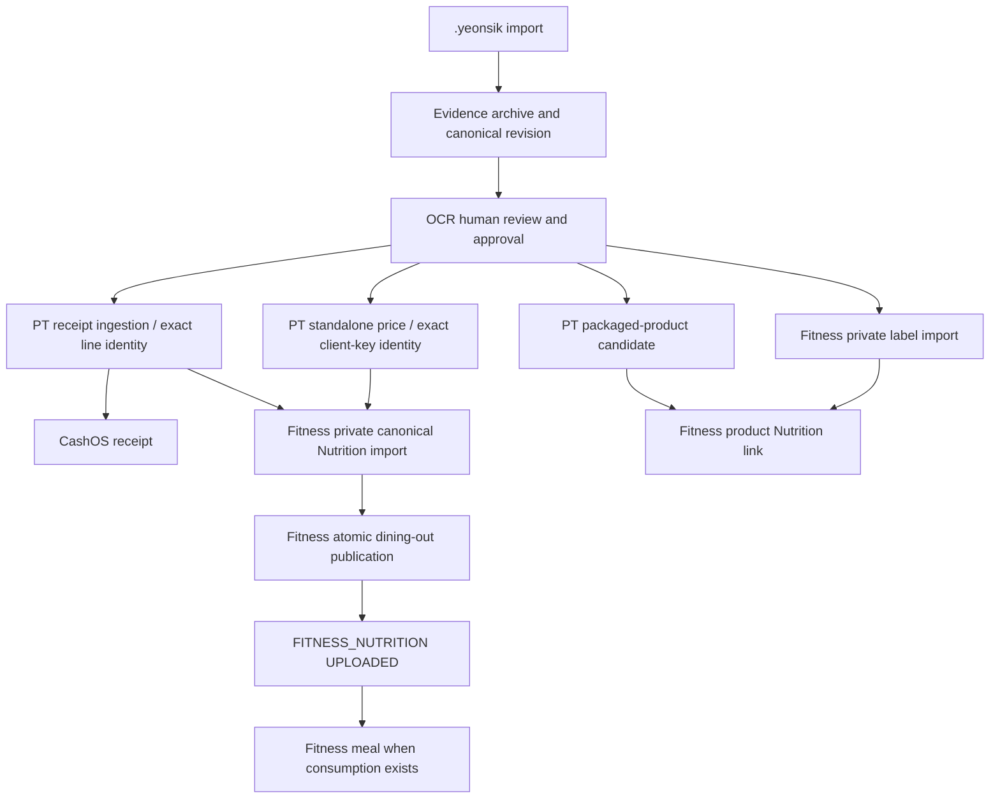

# OCR V5 pipeline completion audit

Date: 2026-10-04 (Asia/Seoul).

## Scope and authority

OCR is the only review surface. PriceTrace owns Product/Restaurant/Menu identity;
Fitness owns Nutrition; CashOS owns transactions. Each service commits independently.
OCR coordinates durable dependencies and retries. Canonical envelopes do not gain
publication flags, authority UUIDs, or extra user-verification authority.

## Root causes repaired

1. Evidence could trust a mixed local session; canonical revisions now verify JWT/local/
   remote user consistency and artifact/parent ownership before inserting.
2. PostgreSQL bound unqualified parent/artifact columns inside the old revision-policy
   subquery to the inner parent row. A valid revision-2 parent therefore failed RLS.
   The forward repair preserves owner/artifact checks and the composite parent FK.
3. Older Fitness `UPLOADED` checkpoints meant private import completion. They are now
   reopened for OCR approval when a valid V5 publication receipt is absent.
4. Old PT metadata omitted its current server-issued resolution token. Recovery reads
   the accepted owner checkpoint instead of reconstructing legacy receipt payloads.
5. Existing canonical Nutrition imports are read through owner RLS and reused for
   publication. Changed request fingerprints are never replayed into an old import.
6. Resolution response loss, incomplete sibling state, fallback read failure, and codec
   changes cannot silently recreate an accepted PT receipt or lose the original import selector.
7. Pending PT identity resolution can change merchant/menu identity source facts; changing
   accepted receipt financial/document facts is blocked with a revision conflict.
8. CashOS responsive CI fixtures and the new-asset empty-state action were corrected.
   Its financial and OCR RPC flows are unchanged.
9. PT's receipt enricher and merchant resolution RPC both inserted the same Menu
   observation. Different legacy evidence fingerprints caused `23505`; a single
   guarded writer now reuses the immutable observation only for an exact identity.
10. Merchant-only source edits retain the legacy Fitness key and owner-audit selector.
    Publication success switches its runtime hash to the current completion contract,
    so later unrelated canonical revisions cannot reset the completed import.
11. The existing nullable receipt guard also protects accepted standalone price facts.
    Amount/date/client-key/quantity/evidence changes fail before saving; merchant/menu
    source facts remain editable through the existing canonical review rules.

12. The V5 strong-signal resolver could create another identity for an older verified
    `pricetrace-db-store` location whose contact facts were missing. A private owner
    recovery proves the immutable receipt/store/item/observation binding and original
    verified source fingerprint, restores only matching missing facts, then reuses
    the existing identity through the normal resolver. Competing identities fail closed.
13. The first recovery function referenced an `updated_at` column absent from the
    deployed Location table; a new forward compatibility migration removes that write.
    PostgreSQL fixtures now use the actual table shape and apply both migrations twice.
14. A pending owner-response refresh changed review status to `NEEDS_REVIEW` even
    during an approved resolution, and exact success retained that stale status.
    Core restores `READY` only for the same explicitly verified canonical fingerprint,
    complete exact identities, no pending PT review/read error and no blocked target.
    Missing approval or unresolved statuses can never gain review authority this way.

## Reproduction and repaired state transition

- Evidence failure: import a bundle, archive it, edit a canonical field, archive revision 2
  with a non-null parent. The old RLS subquery rejected the valid parent with 42501.
  Session and ownership errors are diagnosed separately before POST; the forward policy
  and composite parent FK retain owner/artifact/parent isolation.
- Legacy dining-out failure: load an import-only Fitness checkpoint and a legacy PT
  response, confirm the saved source facts in OCR, resolve the server-issued token.
  The original duplicate writer failed with 23505; the initial strict resolver proposed
  a different identity and the immutable observation guard rejected it with 23514.
- Repaired transition: legacy `UPLOADED` -> Nutrition `PENDING` + `NEEDS_REVIEW` -> explicit
  OCR approval -> authenticated PT exact/resolved response -> original canonical import
  reuse -> atomic publication -> Nutrition `UPLOADED` version 1 and review `READY`.
- An ambiguous or insufficient identity remains `NEEDS_REVIEW`; public publication is
  not called. A transient publication failure retains the same import/publication keys.
## Projection dependency graph

No new external `projection_targets` contract was introduced. The completion version
and accepted-receipt facts guard are local runtime state, persisted by both platforms.

## Normal dining-out sequence

1. Validate bundle/evidence and archive canonical edits.
2. User confirms source facts in OCR and sends once.
3. PT accepts source facts and returns explicit exact merchant and resolved menu statuses.
4. OCR selects each Nutrition item by exact `line_id`/`sourceLineId`, or standalone
   `priceObservationClientKey`. It requires all four server identity IDs.
5. Fitness imports a private canonical estimate and calls the atomic publication RPC.
6. Only import plus publication completion marks `FITNESS_NUTRITION` uploaded.
7. CashOS and other eligible targets follow their existing independent dependencies.

Missing/null/unknown/pending/unverified/ambiguous authority status fails closed.
OCR preserves resolutionId/reasonCode/requiredSourceFacts as server-response metadata.
Unestimated receipt lines never create Nutrition rows.

## Partial failure and recovery

- Publication failure: retain deterministic keys and retry the canonical replay/publication.
- Legacy private import: read exact owner audit row, verify source document/client key and
  Nutrition/evidence facts, then publish using the original audit key as the key seed.
- PT resolution response loss: owner-read the saved response before using the token again.
  Accepted exact receipt/sibling targets recover their completion without another ingestion.
- Legacy-key fallback read failure: retain prior server import selectors; flatten/deduplicate
  metadata so repeated failures preserve selectors without accumulating nested arrays.
- Canonical revision failure: preserve the same pending snapshot and edit history for retry.
- Cash-only retry: identity/publication recovery failure does not add a new CashOS gate.

## Deployment and persistence

- PT forward migration: `20261003161207_ocr_verified_receipt_checkpoint_read.sql`.
  Owner-authenticated getter, no anonymous/public execution, unique saved response required.
  Applied to the configured PT project. Real read-only owner/foreign/anon SQL smoke passed.
- PT forward migration: `20261004002338_ocr_receipt_menu_observation_reuse.sql`.
  Applied and registered; helper API/anon execution remains revoked, owner RPC is
  authenticated-only, and RLS remains enabled. No receipt/observation row was deleted.
- PT forward migrations: `20261004063208_ocr_legacy_store_identity_recovery.sql` and
  `20261004064719_ocr_legacy_store_identity_schema_compatibility.sql`.
  Both are applied and registered. Owner-approved recovery preserves existing UUIDs and
  observations, does not invent branch labels, and exposes no new client write path.
- Evidence owner-policy repair from this branch is already applied to the configured project.
- Fitness V5 publication and generic import repair migrations are already deployed.
- Android Room 12 -> 13 adds local completion/receipt guard fields with safe defaults.
  Existing rows, keys, metadata and source snapshots are preserved.
- Desktop JSON accepts absent legacy fields and retains pending revisions and review edits.
- Runtime `.env` was backed up before restoring six missing service-scoped bootstrap fields
  from the existing matching-project local configuration. Secrets are not committed.

## Validation record

PT full suite: 500 tests in 49 files, including 61 executable PostgreSQL engine cases;
lint/typecheck/production build passed. PT main Pages and documentation CI passed at
`bb6bf825e9ae4c385f5e1b597aa6d68b1d73079c` (PR #57 merged).
OCR final local gate passed: Core 236 tests and Android 104 tests, no failures/errors.
Desktop 38 tests passed with two opt-in integration tests skipped by default; those
manual tests were executed separately. The final approved controller retry also
asserts persisted review `READY`, successful publication completion and a second send
with unchanged durable projection identities; it passed against the configured services. Android/Desktop and Room migration instrumentation
sources compile. Added review-state regressions cover exact receipt/standalone recovery,
missing explicit approval, unknown/pending authority, successful owner resolution/replay,
and ambiguity with zero Nutrition calls.

Fitness latest main unit/compile validation passed (439 app tests) and its current main
release-readiness CI is green. CashOS main CI is green after the scoped PR #28 fixes
(350 unit tests, 17 browser scenarios and lint/typecheck/build/budget checks).

### Real approved record and remote proof

The explicitly approved existing record passed the real owner-authenticated Desktop
controller path: load -> review saved facts -> resolve PT token -> reuse private import
-> public/link -> send again. The controller calls ordinary authenticated RPCs, and
remote verification SQL is read-only. No client direct downstream writes were used.

| Check | Before | After review and repeated send |
| --- | --- | --- |
| PT owner receipts / ingestion contents | 1 / 1 | 1 / 1 |
| PT Restaurant / Location / Menu rows | 5 / 5 / 5 | 5 / 5 / 5 |
| PT receipt Menu observations | 1 | 1; same UUID and immutable fingerprint |
| PT merchant / source-line status | needs OCR review / unresolved | exact / resolved |
| Fitness canonical imports | 1 | 1; same original import and Nutrition IDs |
| Fitness publication for this Nutrition | 0 | 1 |
| Fitness food visibility / link | private | public / approved; exact four PT IDs |
| Cash receipt / binding / revision identities | 1 / 1 / 1 | 1 / 1 / 1; original receipt key |
| Cash transaction ingestion rows | 0 | 0 |
| OCR approved review state | stale needs_review | READY; verified fingerprint preserved |

Evidence deployed RLS is enabled with `owner_id = auth.uid()` plus exact owned artifact
existence. The composite parent/Artifact/owner FK is present. Four archived canonical
revisions remain in the configured project; no source/revision data was deleted.

### Required scenarios and proof scope

| Scenario | Evidence |
| --- | --- |
| A existing receipt-backed Restaurant | Real approved OCR -> PT exact -> original Fitness import -> public/link -> replay passed |
| B new Restaurant with safely exact PT identity | PT resolver and OCR/Fitness fixture regressions; no second live user record created |
| C ambiguity | Needs-review and zero-publication regression tests; identity/source conflicts fail closed in PostgreSQL |
| D multiple receipt lines | Exact source-line mapping regressions and PostgreSQL cases; unestimated lines do not create Nutrition |
| E temporary publication failure / response loss | Original deterministic import/publication key recovery regressions |
| F same bundle / repeated send | Real repeated send with unchanged remote counts plus Core replay regressions |
| G packaged and insufficient receipt-free identity | Existing Android/Core fixtures; private import and publication-pending/fail-closed cases |

The Android Room migration instrumentation sources compile. No connected Android device
was available, so device execution remains unverified. The Windows launch check verifies
the built executable, running process and window title, not a visual screenshot audit.

Manual integration tests are opt-in and excluded from normal CI execution:

- `YEONSIK_CHECKPOINT_INTEGRATION_RECORD`: owner HTTP read using a copy of the saved record.
- `YEONSIK_APPROVED_CHECKPOINT_ID`: actual OCR controller review/publication, only after
  explicit owner confirmation. This path writes remote state and must not be run with
  an unapproved record. It performs no direct downstream database writes.

Use `--rerun-tasks` when running either opt-in test: Gradle does not treat these
environment-variable changes as test-task inputs. A normal CI skip is distinct from
the separately executed live integration result.

## Files changed

- Core ingestion models/orchestrator/use case and regression tests.
- PT canonical gateway owner-reader and Android mock gateway tests.
- Fitness canonical gateway/models/submitter and recovery regressions.
- Desktop controller/store and persistence/opt-in integration tests.
- Android validator, Room entities/database and migration instrumentation.
- Earlier branch commits: Evidence session/ownership validation and forward RLS repair;
  review fields and explicitly linked product-name synchronization.
- Separate services: PT getter migration/contract/tests/source pack (PR #55),
  PT guarded writer/legacy identity recovery (PR #56/#57), and CashOS investment
  action/responsive tests (PR #28).

Fitness application source and cross-service database ownership boundaries were preserved.

## OCR changed file inventory

- `app/src/main/java/com/pricetrace/receiptocr/AndroidCanonicalJsonValidator.kt`
- `app/src/test/java/com/pricetrace/receiptocr/pricetrace/PriceTraceCanonicalGatewayTest.kt`
- `core/src/main/java/com/pricetrace/receiptocr/fitness/FitnessCanonicalProjectionSubmitter.kt`
- `core/src/main/java/com/pricetrace/receiptocr/fitness/NutritionCanonicalModels.kt`
- `core/src/main/java/com/pricetrace/receiptocr/fitness/NutritionSupabaseGateway.kt`
- `core/src/main/java/com/pricetrace/receiptocr/pricetrace/PriceTraceCanonicalGateway.kt`
- `core/src/main/java/com/pricetrace/receiptscanner/ingestion/CanonicalIngestionUseCase.kt`
- `core/src/main/java/com/pricetrace/receiptscanner/ingestion/EvidenceArchive.kt`
- `core/src/main/java/com/pricetrace/receiptscanner/ingestion/IngestionModels.kt`
- `core/src/main/java/com/pricetrace/receiptscanner/ingestion/IngestionOrchestrator.kt`
- `core/src/main/java/com/pricetrace/receiptscanner/review/CanonicalReviewController.kt`
- `core/src/test/java/com/pricetrace/receiptocr/fitness/FitnessCanonicalRecoveryTest.kt`
- `core/src/test/java/com/pricetrace/receiptscanner/ingestion/EvidenceSupabaseArchivePortTest.kt`
- `core/src/test/java/com/pricetrace/receiptscanner/ingestion/LegacyDiningOutCheckpointRecoveryTest.kt`
- `core/src/test/java/com/pricetrace/receiptscanner/review/CanonicalProductNameReviewTest.kt`
- `desktop-app/.env.example`
- `desktop-app/src/main/kotlin/com/yeonsik/ingestion/desktop/CollectorReview.kt`
- `desktop-app/src/main/kotlin/com/yeonsik/ingestion/desktop/DesktopIngestionController.kt`
- `desktop-app/src/main/kotlin/com/yeonsik/ingestion/desktop/DesktopRuntimeConfig.kt`
- `desktop-app/src/main/kotlin/com/yeonsik/ingestion/desktop/DesktopSessionStore.kt`
- `desktop-app/src/test/kotlin/com/yeonsik/ingestion/desktop/CanonicalReviewFieldsTest.kt`
- `desktop-app/src/test/kotlin/com/yeonsik/ingestion/desktop/DesktopApprovedCheckpointRecoveryTest.kt`
- `desktop-app/src/test/kotlin/com/yeonsik/ingestion/desktop/DesktopCheckpointRemoteIntegrationTest.kt`
- `desktop-app/src/test/kotlin/com/yeonsik/ingestion/desktop/DesktopIngestionRegressionTest.kt`
- `desktop-app/src/test/kotlin/com/yeonsik/ingestion/desktop/DesktopProjectionCompletionPersistenceTest.kt`
- `desktop-app/src/test/kotlin/com/yeonsik/ingestion/desktop/DesktopRuntimeConfigTest.kt`
- `docs/validation/OCR_V5_PIPELINE_COMPLETION.md`
- `infra/evidence-supabase/migrations/20261003_fix_canonical_revision_owner_rls.sql`
- `infra/evidence-supabase/tests/canonical_revision_owner_rls.md`
- `infra/evidence-supabase/tests/canonical_revision_rls_smoke.sql`
- `receipt-scanner/src/androidTest/java/com/pricetrace/receiptscanner/storage/ReceiptDatabaseMigrationTest.kt`
- `receipt-scanner/src/main/java/com/pricetrace/receiptscanner/storage/IngestionEntities.kt`
- `receipt-scanner/src/main/java/com/pricetrace/receiptscanner/storage/ReceiptDatabase.kt`

## Delivery and remaining prerequisites

- PT PR #55/#56/#57 and CashOS PR #28 are merged; their required configured migrations
  are deployed. Fitness current main requires no source change for this recovery.
- OCR PR #21 contains the Evidence auth/RLS fix, simpler review fields and shared legacy
  publication recovery. Final merge/build results are reported with the delivered SHA.
- Desktop runtime credentials are bootstrapped consistently; client secrets are omitted
  from source, generated bundles and this report.
- Existing pending revisions keep their saved snapshot and can be retried after valid
  authentication and owned artifact/parent validation; no re-entry of edits is required.
- A newer separately unapproved packaged record stays awaiting user review and is not
  sent automatically. Only the explicitly approved legacy record was recovered live.
- Android device migration/UI execution remains a separate outstanding verification;
  Core/unit/compile checks do not substitute for physical device proof.