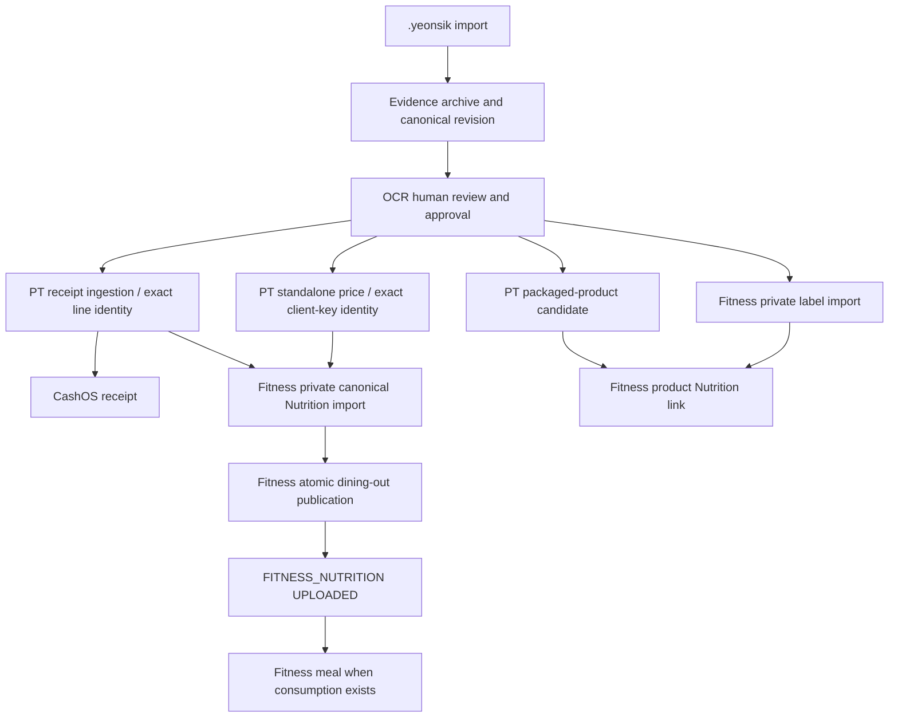

# OCR V5 pipeline completion audit

Date: 2026-10-04 (Asia/Seoul).

## Scope and authority

OCR is the only review surface. PriceTrace owns Product/Restaurant/Menu identity;
Fitness owns Nutrition; CashOS owns transactions. Each service commits independently.
OCR coordinates durable dependencies and retries. Canonical envelopes do not gain
publication flags, authority UUIDs, or extra user-verification authority.

## Root causes repaired

1. Evidence could trust a mixed local session; canonical revisions now verify JWT/local/
   remote user consistency and artifact/parent ownership before inserting.
2. PostgreSQL bound unqualified parent/artifact columns inside the old revision-policy
   subquery to the inner parent row. A valid revision-2 parent therefore failed RLS.
   The forward repair preserves owner/artifact checks and the composite parent FK.
3. Older Fitness `UPLOADED` checkpoints meant private import completion. They are now
   reopened for OCR approval when a valid V5 publication receipt is absent.
4. Old PT metadata omitted its current server-issued resolution token. Recovery reads
   the accepted owner checkpoint instead of reconstructing legacy receipt payloads.
5. Existing canonical Nutrition imports are read through owner RLS and reused for
   publication. Changed request fingerprints are never replayed into an old import.
6. Resolution response loss, incomplete sibling state, fallback read failure, and codec
   changes cannot silently recreate an accepted PT receipt or lose the original import selector.
7. Pending PT identity resolution can change merchant/menu identity source facts; changing
   accepted receipt financial/document facts is blocked with a revision conflict.
8. CashOS responsive CI fixtures and the new-asset empty-state action were corrected.
   Its financial and OCR RPC flows are unchanged.
9. PT's receipt enricher and merchant resolution RPC both inserted the same Menu
   observation. Different legacy evidence fingerprints caused `23505`; a single
   guarded writer now reuses the immutable observation only for an exact identity.
10. Merchant-only source edits retain the legacy Fitness key and owner-audit selector.
    Publication success switches its runtime hash to the current completion contract,
    so later unrelated canonical revisions cannot reset the completed import.
11. The existing nullable receipt guard also protects accepted standalone price facts.
    Amount/date/client-key/quantity/evidence changes fail before saving; merchant/menu
    source facts remain editable through the existing canonical review rules.

## Projection dependency graph

No new external `projection_targets` contract was introduced. The completion version
and accepted-receipt facts guard are local runtime state, persisted by both platforms.

## Normal dining-out sequence

1. Validate bundle/evidence and archive canonical edits.
2. User confirms source facts in OCR and sends once.
3. PT accepts source facts and returns explicit exact merchant and resolved menu statuses.
4. OCR selects each Nutrition item by exact `line_id`/`sourceLineId`, or standalone
   `priceObservationClientKey`. It requires all four server identity IDs.
5. Fitness imports a private canonical estimate and calls the atomic publication RPC.
6. Only import plus publication completion marks `FITNESS_NUTRITION` uploaded.
7. CashOS and other eligible targets follow their existing independent dependencies.

Missing/null/unknown/pending/unverified/ambiguous authority status fails closed.
OCR preserves resolutionId/reasonCode/requiredSourceFacts as server-response metadata.
Unestimated receipt lines never create Nutrition rows.

## Partial failure and recovery

- Publication failure: retain deterministic keys and retry the canonical replay/publication.
- Legacy private import: read exact owner audit row, verify source document/client key and
  Nutrition/evidence facts, then publish using the original audit key as the key seed.
- PT resolution response loss: owner-read the saved response before using the token again.
  Accepted exact receipt/sibling targets recover their completion without another ingestion.
- Legacy-key fallback read failure: retain prior server import selectors; flatten/deduplicate
  metadata so repeated failures preserve selectors without accumulating nested arrays.
- Canonical revision failure: preserve the same pending snapshot and edit history for retry.
- Cash-only retry: identity/publication recovery failure does not add a new CashOS gate.

## Deployment and persistence

- PT forward migration: `20261003161207_ocr_verified_receipt_checkpoint_read.sql`.
  Owner-authenticated getter, no anonymous/public execution, unique saved response required.
  Applied to the configured PT project. Real read-only owner/foreign/anon SQL smoke passed.
- PT forward migration: `20261004002338_ocr_receipt_menu_observation_reuse.sql`.
  Applied and registered; helper API/anon execution remains revoked, owner RPC is
  authenticated-only, and RLS remains enabled. No receipt/observation row was deleted.
- Evidence owner-policy repair from this branch is already applied to the configured project.
- Fitness V5 publication and generic import repair migrations are already deployed.
- Android Room 12 -> 13 adds local completion/receipt guard fields with safe defaults.
  Existing rows, keys, metadata and source snapshots are preserved.
- Desktop JSON accepts absent legacy fields and retains pending revisions and review edits.
- Runtime `.env` was backed up before restoring six missing service-scoped bootstrap fields
  from the existing matching-project local configuration. Secrets are not committed.

## Validation record

Local gate: Core 231 tests, Android 104 tests, Desktop 38 tests (two manual integration
cases skipped by default), zero failures/errors. Android/Desktop and Room migration
instrumentation sources compile. PT full suite 480 tests including 41 PostgreSQL
engine cases passed, along with lint/typecheck/production build.

Live recovery currently stops safely before publication on a legacy identity conflict.
The existing verified observation has an exact owner receipt/store/item/price binding,
but its `pricetrace-db-store` location lacks address/phone. The strict V5 resolver did
not use that server binding and proposed another Restaurant/Location. Investigation
confirmed the original owner-verified receipt source and approved contact facts agree.
The final owner resolution/publication result will be appended after this narrow
server recovery is validated; no mismatched identity was published.
The Android migration instrumentation source is included; no connected Android device
was available, so device execution must be distinguished from compilation/unit tests.

Manual integration tests are opt-in and excluded from normal CI execution:

- `YEONSIK_CHECKPOINT_INTEGRATION_RECORD`: owner HTTP read using a copy of the saved record.
- `YEONSIK_APPROVED_CHECKPOINT_ID`: actual OCR controller review/publication, only after
  explicit owner confirmation. This path writes remote state and must not be run with
  an unapproved record. It performs no direct downstream database writes.

Use `--rerun-tasks` when running either opt-in test: Gradle does not treat these
environment-variable changes as test-task inputs. A normal CI skip is distinct from
the separately executed live integration result.

## Files changed

- Core ingestion models/orchestrator/use case and regression tests.
- PT canonical gateway owner-reader and Android mock gateway tests.
- Fitness canonical gateway/models/submitter and recovery regressions.
- Desktop controller/store and persistence/opt-in integration tests.
- Android validator, Room entities/database and migration instrumentation.
- Earlier branch commits: Evidence session/ownership validation and forward RLS repair;
  review fields and explicitly linked product-name synchronization.
- Separate services: PT getter migration/contract/tests/source pack (PR #55),
  CashOS investment action/responsive tests (PR #28).

Fitness application source and cross-service database ownership boundaries were preserved.
